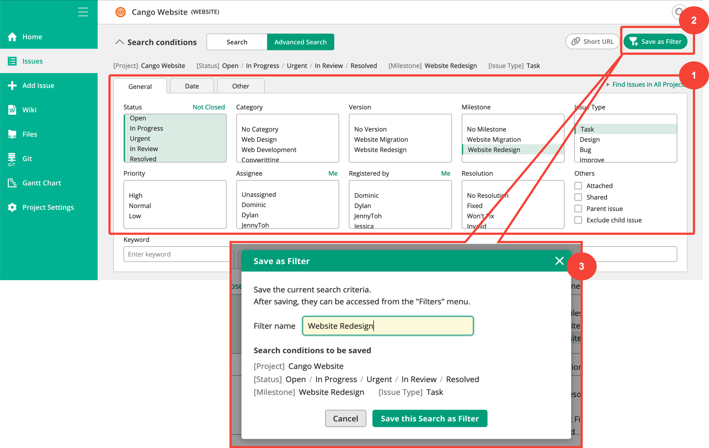

Saving search criteria

https://support.backlog.com/hc/en-us/articles/115015418747-Saving-search-criteria

Frequently-used search conditions can be saved. To save search criteria, first filter the issues by selecting the desired search conditions and entering keywords on the Find issues page. Then, click "Save as Filter".

You can name the criteria on the Filters panel.

 

The saved search criteria are stored under "Filters" on the Global Navigation bar. For more details, please refer to [Filters](https://support.backlog.com/hc/en-us/articles/115015420227-Filters).