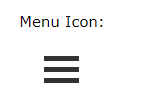
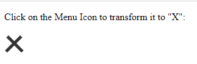

# Menu Icon (Text)

https://www.w3schools.com/howto/howto_css_menu_icon.asp


## 1 How To Create a Menu Icon

If you are not using an icon library, you can create a basic menu icon with CSS:




HTML Code

```html
<div></div>
<div></div>
<div></div>
```


CSS

```css
div {
  width: 35px;
  height: 5px;
  background-color: black;
  margin: 6px 0;
}
```


**Example Explained**

The `width` and the `height` property specifies the width and height of each bar.

We have added a black `background-color`, and the top and bottom `margin` is used to create some distance between each bar.


## 2 Animated ICON



TODO: https://www.w3schools.com/howto/howto_css_menu_icon.asp

